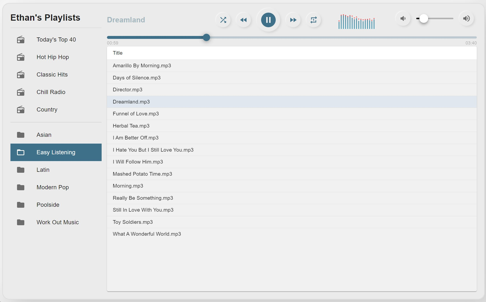
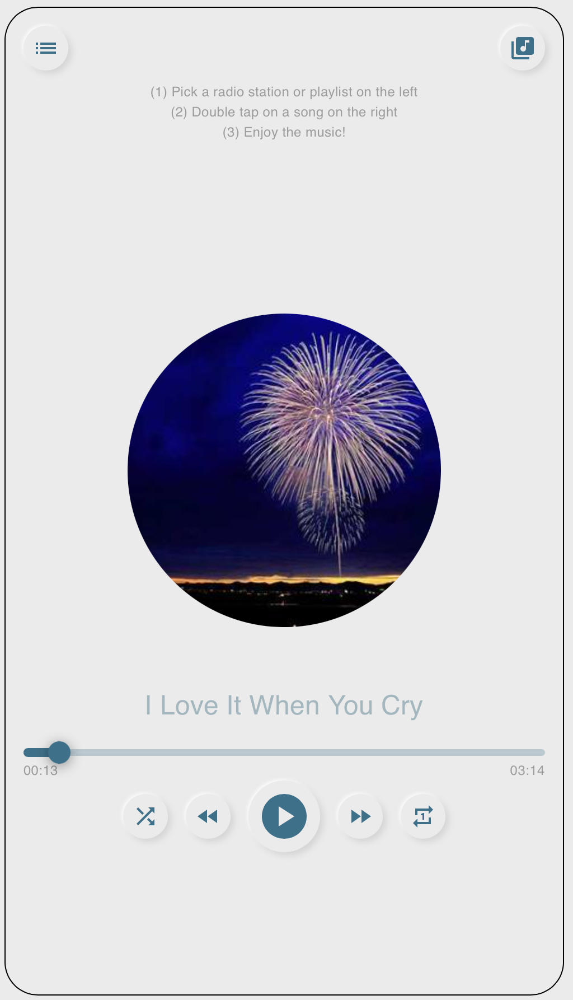
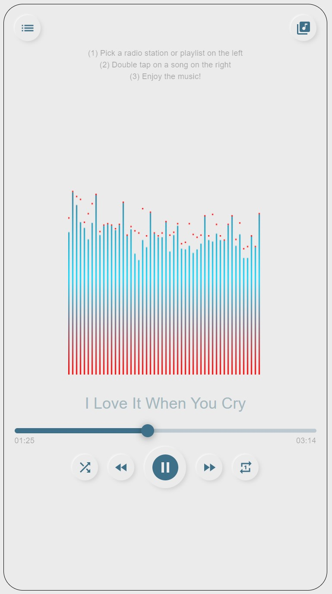

# 🎵 Music Player App 🎵

Play your favorite songs and radio stations all in one app!

[Check it out!](https://music-app-etuong.vercel.app/)

## Screenshots

Desktop view



Mobile view on Safari and Chrome

<p float="left">
    
    
</p>

## 🔨 Installation

This web app supports radio stations and custom playlists. The playlists are parsed from S3. Use `.env.sample` to create a `.env.local` and put in your credentials. Run `npm install` to install the dependencies and start with `npm run dev`.

## 🧰 Components

- Songs: Display a list of songs from a selected playlist
- Controller: Only on Desktop, display a control panel
- TrackSlider: Display a time-based duration component to manage track
- Spectrum: Display an audio visualizer
- Playlist: Display playlists from S3 (or any source)
- Mobile: Display app on mobile view for a more responsive user experience

## 🗈 Notes

1. In Safari on iOS (for all devices, including iPad), where the user may be on a cellular network and be charged per data unit, audio `preload` and `autoplay` are disabled. This app will not work on Safari unless user enables autoplay on their browser setting.
1. The organization of the playlists and songs in S3 (or any source) must be
   ```
   playlist1
       -> song1
       -> song2
       -> song3
   playlist2
       -> song4
       -> song5
   ...
   ```
1. You should also considering using a CDN. I would suggest Cloudfront because it works really well with S3 especially when it comes to security policies. Amazon CloudFront is a global content delivery network (CDN) service that securely delivers data, videos, applications, and APIs to your viewers with low latency and high transfer speeds.

## 🔧 Technologies

- [React](https://reactjs.org/)
- [Next.js](https://nextjs.org/)
- [AWS S3](https://aws.amazon.com/s3/)
- [Web Audio API](https://developer.mozilla.org/en-US/docs/Web/API/Web_Audio_API)
